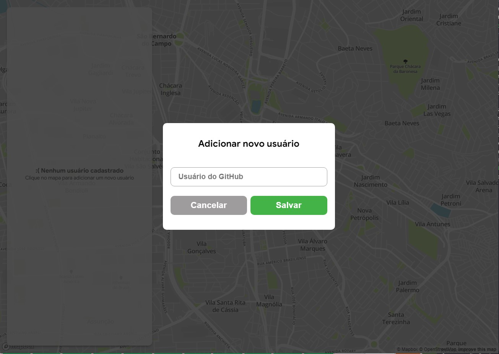
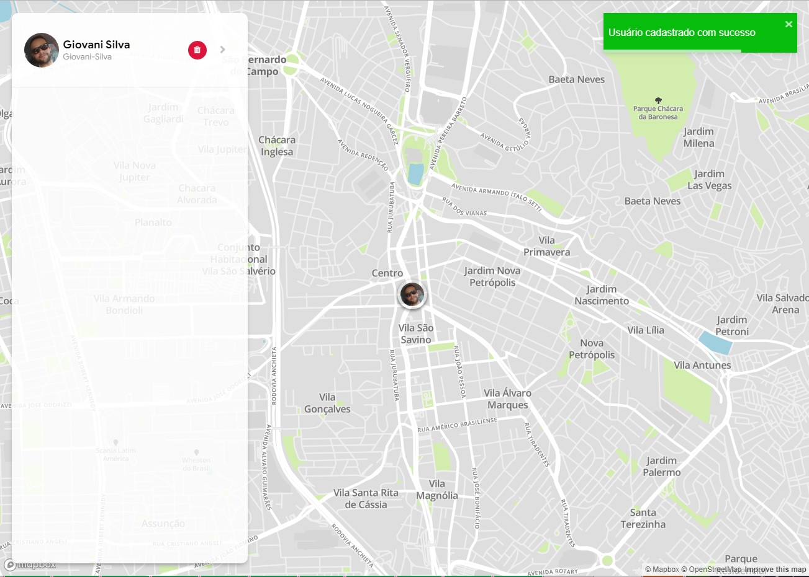

# Dev Location

A aplicação se trata de um repositório de localização de desenvolvedores. O usuário poderá adicionar desenvolvedores ao mapa clicando sobre o mesmo e informando o username do Github do desenvolvedor.

- React
- Styled Component
- Map GL da Uber
- EsLint
- API Github

## Fluxo

1. O usuário acessa a aplicação;
2. O usuário clica sobre o mapa para adicionar um novo usuário à posição clicada;
3. Um modal abre sobre a tela com um único campo, o username do Github;
4. A aplicação busca informações como nome e avatar do usuário da API do Github e salva o
   usuário no store do Redux;
5. O usuário adicionado agora aparece no mapa e na lista lateral;
6. Caso o usuário digitado no input for inválido uma mensagem deve ser retornada, assim
   como se tudo ocorrer bem deve ser retornada uma mensagem de sucesso;
7. Deve ser possível excluir usuários da listagem clicando sobre o “x” na sidebar;

> “Se você acha que pode, ou que não pode, das duas formas você está certo”!
